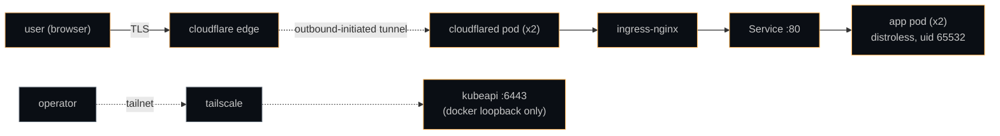

> for razvan: there are 9 things to find. start with `view-source:`.

# k8s-playground

a one-shot demo of running kubernetes locally on apple silicon and
exposing a single service publicly without opening any inbound ports.
no platform team, no opinions about gitops, no production claims — just
a clean walkthrough of the moving parts.

- **public**: <https://puiemrazvan.momentan.fun>
- **stack**: next.js 15 / k3d / nginx-ingress / cloudflare tunnel / tailscale
- **host**: macOS on apple silicon, fish shell

## architecture



the in-app diagram on the live site is hand-rolled SVG and shows more
detail.

## prerequisites

local tools (`brew install` covers most):

- Docker Desktop (apple silicon)
- k3d v5.x
- kubectl (kustomize built in)
- helm 3.x
- pnpm 11 + node 20 LTS (newer node works locally; the image is pinned to 20)
- cloudflared 2026.x
- tailscale (already installed, signed in)
- gh CLI
- jq
- trivy
- gitleaks

a cloudflare account with `momentan.fun` on cloudflare DNS, and an API
token with these scopes:

- Zone — DNS — Edit (on momentan.fun)
- Zone — Zone — Read
- Account — Cloudflare Tunnel — Edit

## env vars (fish)

set once per shell:

```fish
set -gx CLOUDFLARE_API_TOKEN "your-token"
```

**option A — persist in fish config:**

```fish
echo 'set -gx CLOUDFLARE_API_TOKEN "your-token"' >> ~/.config/fish/config.fish
```

**option B — direnv with fish hook:**

```fish
# in ~/.config/fish/config.fish
direnv hook fish | source
```

then create `.envrc` (gitignored) in the repo root:

```sh
export CLOUDFLARE_API_TOKEN="your-token"
```

and `direnv allow`.

## quickstart

```fish
git clone git@github.com:tudorpie/k8s-playground
cd k8s-playground
set -gx CLOUDFLARE_API_TOKEN "your-token"
make all
```

stages:

```
up      → k3d cluster (1 server + 1 agent) + ingress-nginx via helm
build   → docker buildx for linux/arm64 + import into k3d
tunnel  → cloudflare tunnel create + ingress config + DNS CNAME + k8s Secret
deploy  → kubectl apply -k k8s/ + rollout wait
```

after `make all` returns:

```fish
curl -I https://puiemrazvan.momentan.fun
```

## verification

```fish
make verify
```

the script confirms:

- pod runs as uid 65532
- no shell is present in the runtime container
- the ServiceAccount has no token mounted
- NetworkPolicy blocks traffic from the `default` namespace
- the PSA admission controller rejects `tests/sample-bad/pod-privileged.yaml`
- common scanner paths return 404 (or no response) on the public URL
- the required security headers are present (CSP, HSTS, X-Frame-Options, ...)
- CSP contains no `unsafe-eval` and no wildcards
- cloudflared pods are Ready
- kubeapi is not reachable on this Mac's public IP
- `/hunt/peek` exposes the pod annotation + the Dockerfile LABEL

## image scanning

```fish
make scan
```

`trivy image` fails the run on any HIGH or CRITICAL CVE in the runtime
image. `trivy config k8s/` and `trivy fs .` are report-only.

## tailscale (kubeapi)

```fish
make tailscale-kubeapi
```

this calls `tailscale serve --bg https+insecure://localhost:6443`. other
devices on your tailnet can then point kubectl at
`https://<machine>.<tailnet>.ts.net/` and authenticate via the same kubeconfig
client cert. the public internet sees nothing.

## teardown

```fish
make down
```

deletes the k3d cluster, the cloudflare tunnel, and the DNS record (in
that order; uses `.cloudflared.state` to know what to remove). idempotent.

## troubleshooting

**k3d hangs at startup on apple silicon.**
flush stale layers, then preseed the image:

```fish
docker system prune --all --volumes
docker pull rancher/k3s:v1.31.5-k3s1
make up
```

**cloudflared keeps reconnecting.**
DNS propagation can take 30 – 60 s after `make tunnel`. watch
`kubectl logs -n k8s-playground deploy/cloudflared -f` — when you see
`Registered tunnel connection`, you're live.

**PSA rejected my edit to the deployment.**
the namespace enforces `restricted`. any change must keep:
`runAsNonRoot`, `allowPrivilegeEscalation: false`, `capabilities.drop: [ALL]`,
`seccompProfile.type: RuntimeDefault`, and no host namespaces / hostPath /
host ports.

**NetworkPolicy is dropping a connection I want.**
by default the namespace denies both directions. to allow new traffic,
add a `NetworkPolicy` that targets your pod via labels and an explicit
`ingress` or `egress` rule. `kubectl describe networkpolicy -n
k8s-playground` shows the effective set.

**fish env vars don't survive a new shell.**
`set -gx` only lasts the current shell. either:
- put the line in `~/.config/fish/config.fish`, or
- use universal scope: `set -Ux CLOUDFLARE_API_TOKEN "..."`

**`pnpm install` complains about node 26.**
local install needs node 20+. newer node is fine on the host — the
runtime image is pinned to node 20 LTS.

**`docker buildx build` fails with "no builder".**
`docker buildx create --use --name multiarch` once, then retry.

## deliberately missing

mirrors the section on the live site:

- backups (no etcd snapshotting, no offsite copies)
- multi-node HA (one server, one agent, no quorum)
- monitoring + alerting (no prometheus, no grafana, no pager)
- log aggregation (`kubectl logs` is the user experience)
- secrets management beyond env vars and the kubernetes Secret
- persistent volumes (the app is stateless on purpose)
- horizontal autoscaling (replicas pinned at 2)
- cert-manager (cloudflare terminates TLS publicly; in-cluster mTLS out of scope)
- admission policy engine (kyverno, opa-gatekeeper)
- eBPF networking (cilium, hubble)

each of these is a worthwhile next step.

## license

MIT — see [LICENSE](./LICENSE).
